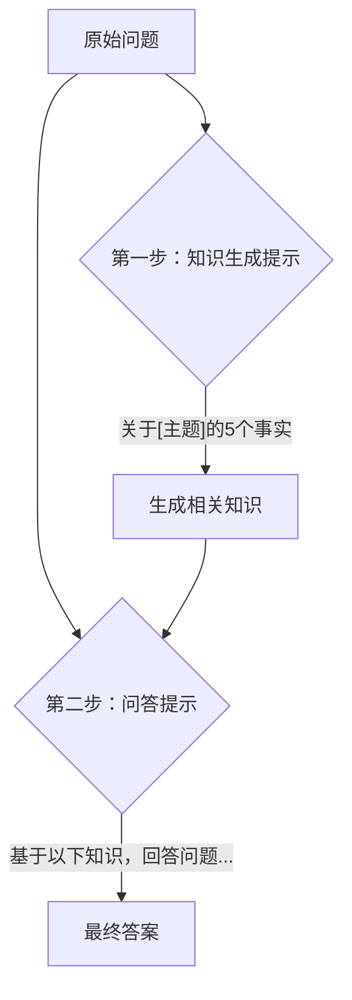

# 第十二章：知识生成：让模型自己教自己

你是否遇到过这样的情况：你向一个学识渊博的朋友请教一个问题，你知道他肯定“知道”答案，但他给出的解释却宽泛、零散，没有切中要害。这并非因为他缺乏知识，而是因为他没能在那一刻有效地组织和激活脑海中相关的知识点。

大型语言模型（LLM）有时也会面临同样的挑战。它们在训练数据中接触过海量的知识，但当我们直接提问时，它们可能无法“想起来”最关键、最相关的部分，导致答案不尽如人意。

本章，我们将探讨一种创新的提示技术——**知识生成提示（Generated Knowledge Prompting）**，它能像一位循循善诱的导师，引导模型“自己教自己”，从而给出更深刻、更准确的回答。

## 当模型“知道”但“想不起来”

让我们从一个问题开始。假设我们想了解一个心理学概念：“元认知”。

**直接提问：**
```prompt
请介绍一下“元认知”在心理学中的主要观点及其对学习策略的影响。
```

模型可能会给出一个正确的、但相对笼统的答案，比如：“元认知是关于认知的认知，它包括元认知知识和元认知监控。它能帮助学习者了解自己的学习过程，并调整策略。”

这个答案没有错，但对于想深入了解该领域的初学者来说，它可能不够具体，缺乏深度。问题来了：我们如何能帮助模型更好地组织其内部已有的知识，以提供更专业的回答呢？

## 什么是知识生成提示？

知识生成提示的核心思想非常巧妙，我们可以将其比喻为**“开卷考试前，先自己准备一份复习笔记”**。

在要求模型直接回答一个复杂问题之前，我们先让它完成一个预备步骤：生成与该问题相关的核心事实或背景知识。然后，在第二步中，我们要求模型基于它自己刚刚生成的这份“复习笔记”来组织和构建最终的答案。

这个“生成-整合-回答”的两步流程，能有效地帮助模型“激活”其内部知识库中那些虽然存在、但不够“活跃”或组织不佳的信息。

其工作流程可以用一个简单的两步图来表示：



## 实战演练：两步法构建答案

让我们通过一个具体的例子，来演练如何使用知识生成提示。

**示例问题**：“请解释一下什么是‘幂律分布’，并举例说明它在现实世界中的应用。”

### 第一步：生成知识 (Knowledge Generation)

我们首先要求模型生成关于“幂律分布”的几个关键事实。

**提示示例：**
```prompt
任务：关于“幂律分布”，请生成 4-5 个关键的核心事实。
```

**预期生成的知识（示例）：**
```text
1. 幂律分布是一种概率分布，其特点是“长尾”，即少数事件的频率极高，而大多数事件的频率极低。
2. 它的数学形式通常表示为 P(x) ~ x^-k，其中 k 是一个常数。
3. 在双对数坐标系下，幂律分布的图形呈现为一条直线。
4. 著名的“二八定律”（帕累托法则）是幂律分布的一个通俗表现。
5. 现实世界中的例子包括：城市人口排名、网站访问量、书籍销量、个人财富分配等。
```
这份由模型自己生成的知识清单，就像一份高度浓缩的复习资料，为回答最终问题做好了充分的准备。

### 第二步：整合知识并回答 (Question Answering)

现在，我们将原始问题与上一步生成的知识结合起来，形成一个新的提示。

**提示示例：**
```prompt
[背景知识]
1. 幂律分布是一种概率分布，其特点是“长尾”，即少数事件的频率极高，而大多数事件的频率极低。
2. 它的数学形式通常表示为 P(x) ~ x^-k，其中 k 是一个常数。
3. 在双对数坐标系下，幂律分布的图形呈现为一条直线。
4. 著名的“二八定律”（帕累托法则）是幂律分布的一个通俗表现。
5. 现实世界中的例子包括：城市人口排名、网站访问量、书籍销量、个人财富分配等。

---

[我的问题]
基于以上背景知识，请用通俗的语言解释一下什么是“幂律分布”，并举例说明它在现实世界中的应用。
```

通过这种方式，我们为模型提供了一个清晰的知识框架。模型不再需要从其庞杂的内部知识库中漫无目的地搜索，而是可以利用这份结构化的“笔记”，给出一个逻辑清晰、内容详实、重点突出的高质量答案。它可能会首先解释“长尾”和“二八定律”的概念，然后自然地引出现实世界中的例子，使整个解释过程更加流畅和易于理解。

## 与 RAG 的对比

看到这里，你可能会联想到我们在后续章节将要介绍的另一个重要技术——检索增强生成（RAG）。虽然两者都旨在为模型提供额外知识，但它们的知识来源和应用场景有着本质的不同。

| 特性 | 知识生成 (Generated Knowledge) | 检索增强生成 (RAG) |
| :--- | :--- | :--- |
| **知识来源** | 模型**内部**生成的知识 | **外部**的、可验证的知识库（如数据库、文档） |
| **实时性** | 无法获取最新信息（知识截止于模型训练） | 可以访问最新、最准确的信息 |
| **事实准确性** | 可能产生“幻觉”，需要验证 | 准确性高，依赖于外部知识库的质量 |
| **实现成本** | 简单，只需两次提示词调用 | 复杂，需要构建和维护外部知识库及检索系统 |
| **适用场景** | 快速增强对已有知识的利用 | 需要高时效性、高准确性的专业问答 |

简单来说，知识生成是“让模型自己复习”，而 RAG 是“给模型一本参考书”。

## 适用场景与风险

那么，什么时候应该使用知识生成提示呢？

**适用场景：**
- **复杂概念解释**：当需要模型解释一个涉及多方面知识的复杂概念时，如科学理论、哲学思想等。
- **创意写作辅助**：在写故事或文章前，可以先让模型生成关于主题的背景、元素、情节线索，再进行创作。
- **非结构化信息整理**：当需要模型就某个主题，从其庞杂的内部知识中进行结构化、有条理的输出时。

**主要风险：**

> **警告：知识幻觉**
>
> 知识生成提示最大的风险在于，模型在第一步生成的“知识”本身可能是错误的，即产生**“幻觉”**。如果第二步的回答建立在这些错误的基础上，那么最终的答案也必然是错误的。
>
> 因此，对于任何严肃的应用场景，特别是那些对事实准确性要求很高的领域，必须对第一步生成的知识进行人工审核或交叉验证。**切勿盲目信任模型生成的任何“事实”**。

## 动手练习

现在，轮到你来实践了。
1. 选择一个你了解但相对专业的领域（例如，你正在学习的某个编程框架、一段你感兴趣的历史事件，或一个基础的科学理论）。
2. 首先，尝试直接向模型提问，并仔细观察和记录它的答案。
3. 然后，使用本章介绍的知识生成两步法，重新构建你的提问过程。
4. 对比两次得到的答案。你是否发现第二个答案在深度、广度或结构性上有了明显的提升？

通过这个简单的练习，你将能更深刻地体会到，引导模型“自己教自己”是多么强大的一种技巧。它让我们从一个被动的提问者，转变为一个主动的知识构建引导者。