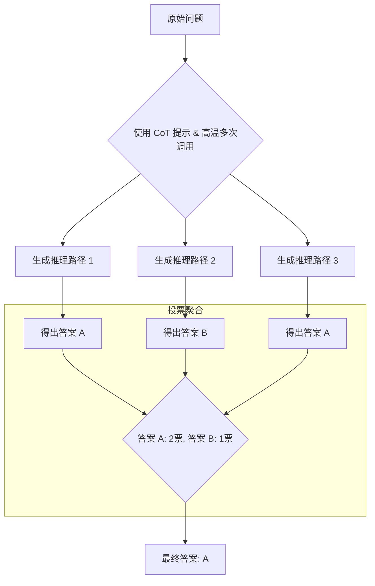

# 第十一章：自我一致性：通过投票提升准确性

在上一章，我们学习了如何通过思维链（CoT）引导模型进行逐步推理，从而显著提升其在复杂问题上的表现。然而，即使是 CoT 也不是万无一失的。有时，模型在推理链条的某一个环节上可能会犯一个微小的错误，导致整个结论的崩塌。

那么，我们能否让模型进行“多次独立思考”，然后从多个结果中找出最可靠的那个呢？答案是肯定的，这便是我们要学习的下一个高级技巧——**自我一致性（Self-Consistency）**。

## 1. 问题引入：当“一步一步思考”也不够时

让我们来看一个比之前更具迷惑性的问题：

> “一个会议室里有10个人，他们每个人都与其他所有的人握了一次手。请问总共发生了多少次握手？”

如果我们使用 CoT 提示，模型可能会给出如下推理：

> **错误的 CoT 推理**：
> “好的，让我们一步一步地思考：
> 1.  第一个人需要和剩下的9个人握手。
> 2.  第二个人也需要和剩下的9个人握手。
> 3.  ...以此类推，第十个人也需要和剩下的9个人握手。
> 4.  所以总的握手次数是 10 * 9 = 90次。”

这个推理看起来很有条理，但它犯了一个经典的重复计算错误（A和B握手与B和A握手是同一次）。正确的答案应该是 `(10 * 9) / 2 = 45` 次。这个例子说明，即使是思维链，也可能在逻辑的关键节点上出错。我们如何能进一步提升结果的可靠性呢？

## 2. 什么是自我一致性？

自我一致性的核心思想非常直观：**当面对一个有多种解法或思路的问题时，那个被多种不同解法共同指向的答案，最可能是正确的答案。**

这就像在解决一个棘手的科学难题时，你不会只咨询一位专家的意见。你会去问多位背景不同的专家，如果他们中的大多数通过不同的方法都得出了相同的结论，那么这个结论的可信度就非常高。自我一致性，就是让同一个 AI 模型扮演“多位独立思考的专家”。

它通常作为 CoT 的一个扩展来使用，其工作流程可以用下图清晰地展示：

## 3. 实战演练：实现自我一致性

实现自我一致性通常遵循一个标准的三步流程。

### 第一步：构建 CoT 提示

首先，我们需要一个能有效激发模型进行逐步推理的提示，通常是零样本或少样本 CoT 提示。

> **提示**：
> “问题：一个班级里，参加足球队有15人，参加篮球队有12人，两个队都参加的有5人。只参加足球队或只参加篮球队的一共有多少人？
> 
> 让我们一步一步地思考。”

### 第二步：设置“温度”（Temperature）参数

这是实现自我一致性的关键。在调用大语言模型 API 时，通常会有一个“温度”（Temperature）参数，它的作用是**控制输出的随机性**。

-   **低温度 (如 0.1, 0.2)**：模型会选择概率最高的词语，输出结果更确定、更保守、更可复现。
-   **高温度 (如 0.7, 1.0)**：模型会引入更多的随机性，即使是同一个提示，每次的输出也可能不同，更具多样性和“创造性”。

为了让模型扮演“多位独立思考的专家”，我们需要它生成**多样化**的推理路径。因此，在实现自我一致性时，**必须将温度设置在一个较高的值（例如 0.7 或更高）**。

### 第三步：多次生成与投票

现在，我们使用相同的提示，以较高的温度，多次（例如 3-5 次）调用模型，并收集所有的输出。

> **模拟多次生成的结果**：
> 
> -   **生成 1**：
>     “只参加足球队的人数是 15 - 5 = 10人。只参加篮球队的人数是 12 - 5 = 7人。所以，只参加一个队的人数总共是 10 + 7 = 17人。 **答案：17**”
> 
> -   **生成 2**：
>     “根据集合原理，总人数 = 足球队人数 + 篮球队人数 - 都参加的人数，即 15 + 12 - 5 = 22人。这些人是至少参加一个队的。其中两个队都参加的是5人。所以只参加一个队的是 22 - 5 = 17人。 **答案：17**”
> 
> -   **生成 3 (推理路径不同，答案相同)**：
>     “我们可以画一个文氏图。左边圆圈是足球队15人，右边是篮球队12人，中间交集是5人。那么，只在左边圆圈的部分是 15 - 5 = 10人。只在右边圆圈的部分是 12 - 5 = 7人。这两个部分的人加起来就是 10 + 7 = 17人。 **答案：17**”
> 
> -   **生成 4 (错误示例)**：
>     “总共有 15 + 12 = 27 人次参加。因为有5人重复，所以实际人数是 27 - 5 = 22人。 **答案：22**”

最后，我们对所有最终答案进行投票：

-   答案 “17” 出现了 3 次。
-   答案 “22” 出现了 1 次。

根据少数服从多数的原则，我们选择“17”作为最可信的最终答案。

## 4. 成本、收益与适用场景

-   **收益**：在算术、常识和符号推理等任务上，自我一致性已被证明能显著提升答案的准确率，效果远超单一的 CoT。
-   **成本**：该方法的成本也非常显著。
    -   **API 调用费用**：如果你调用 5 次，那么 API 费用就是原来的 5 倍。
    -   **时间延迟**：总耗时也是原来的 5 倍左右。
-   **适用场景**：
    -   **答案明确的任务**：最适合答案空间有限且格式统一的任务，如数值计算、多项选择、逻辑判断等。
    -   **高风险决策**：当任务对准确性要求极高，且你愿意为此付出更高成本时（例如，在分析关键的财务数据或进行科学计算时）。
-   **不适用场景**：不适合开放式的、创造性的生成任务（如写诗、总结文章、头脑风暴）。因为这类任务没有唯一的“正确答案”，进行投票没有意义。

## 5. 总结与练习

自我一致性是思维链的自然演进，它通过“群体智慧”来对单一的推理路径进行验证和纠错。它是一种以成本换精度的有效策略。

### 练习

回到本章开头的握手问题：“一个会议室里有10个人，他们每个人都与其他所有的人握了一次手。请问总共发生了多少次握手？”

1.  请先用简单的零样本 CoT 提示（温度设为较低的 0.2）运行一次，记录结果。
2.  再用自我一致性的方法（温度设为较高的 0.8，运行 3-5 次）来解决同一个问题，并对结果进行投票。
3.  比较两次的结果，并思考为什么自我一致性能够有效修正单一推理路径可能犯的错误。