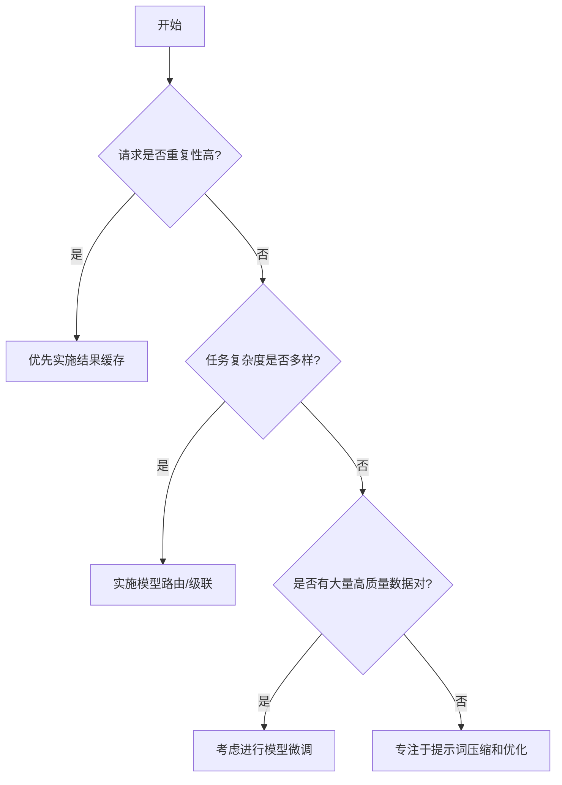

# 第二十章：成本与性能：优化你的 AI 调用

在前面的章节中，我们专注于如何提升提示词的效果，追求 AI 输出的“质量上限”。但当应用从实验走向生产，一个无法回避的现实问题便摆在了面前：成本。每一次对大型语言模型（LLM）的调用，都在燃烧着真金白银。一个设计不当的提示词，可能在无形中让你的服务器账单“一飞冲天”。

欢迎来到提示词工程的“CFO 视角”。本章，我们将学习如何成为一名精打细算的“AI 投资经理”，不仅要关注提示词带来了多少价值（性能），更要计算它花掉了多少预算（成本）。我们的目标，是在效果、成本与响应速度之间，找到那个微妙而完美的平衡点。

## Token 的经济学：理解成本的驱动因素

要控制成本，首先必须理解成本从何而来。在 LLM 的世界里，**Token** 就是一切经济活动的基础货币。

1.  **模型选择 (Model Choice)**: 这是你成本控制中最重要的杠杆。不同能力、不同规模的模型，其单位 Token 的定价差异可能是天壤之别。例如，OpenAI 的 GPT-4o 通常比 GPT-3.5-Turbo 昂贵数倍，而 Anthropic 的 Claude 3 Opus 也远比其兄弟模型 Haiku 昂贵。最强的模型不一定是最好的选择，合适的才是。

2.  **输入 Token (Input Tokens)**: 你发送给模型的**所有内容**——包括角色（Persona）、指令（Instruction）、情境（Context）和示例（Few-shot Examples）——都会被计算为输入 Token。提示词越长，输入成本越高。

3.  **输出 Token (Output Tokens)**: 模型为你生成的每一个字、每一个标点符号，都会被计算为输出 Token。输出越冗长，输出成本越高。

### 成本计算公式

你的总成本可以用一个简单的公式来计算：

> **总成本 = (输入 Token 数 / 1,000,000 * 每百万输入 Token 单价) + (输出 Token 数 / 1,000,000 * 每百万输出 Token 单价)**

让我们来看一个具体的计算示例。假设：
-   你使用了一个模型，其定价为：
    -   输入：$5.00 / 每百万 Token
    -   输出：$15.00 / 每百万 Token
-   你的提示词长度为 1,500 Tokens。
-   模型生成了 500 Tokens 的回复。

那么，处理这**一次**请求的成本就是：
> (1,500 / 1,000,000 * $5.00) + (500 / 1,000,000 * $15.00) = $0.0075 + $0.0075 = $0.015

单次调用看起来微不足道，但如果你的应用每天需要处理 10 万次这样的请求，那么一天的成本就是 `$0.015 * 100,000 = $1,500`！成本控制的重要性不言而喻。

## 性能的度量：超越速度的考量

与成本相对的，是性能。但性能并非只指速度，它是一个多维度的概念：

-   **延迟 (Latency)**: 从发送请求到收到**完整**响应所需的时间。对于聊天机器人、实时代码补全等交互式应用，延迟是影响用户体验的生命线。
-   **吞吐量 (Throughput)**: 单位时间内（如每秒）能够成功处理的请求数量。对于需要批量处理大量数据的离线任务（如批量生成报告），吞吐量是关键指标。
-   **准确性 (Accuracy)**: 模型输出是否符合事实、是否遵循了你的指令、是否达到了预期的业务目标。这是衡量提示词“效果”的核心。
-   **用户满意度 (User Satisfaction)**: 一个更为主观但同样重要的指标，通常通过用户反馈、功能采纳率、会话时长等间接数据来衡量。

## 成本效益权衡：没有免费的午餐

成本与性能往往是一对矛盾体。试图用最便宜的模型达到最佳效果，或者用最贵的模型处理简单任务，都是不切实际的。我们需要根据具体的业务场景，做出明智的权衡。

我们可以用一个四象限图来理解这种关系：

-   **第一象限：高成本 - 高性能 (投资级)**
    -   **场景**: 处理复杂的法律文档分析、医学报告生成、核心代码逻辑编写等。这些任务对准确性要求极高，且愿意为此支付高昂的成本。
    -   **策略**: 使用业界最顶尖、最强大的模型（如 GPT-4o, Claude 3 Opus）。

-   **第二象限：低成本 - 高性能 (效率区)**
    -   **场景**: 处理简单的文本分类、情感分析、关键词提取等高频、标准化的任务。
    -   **策略**: 使用轻量级、速度快、成本低的模型（如 GPT-3.5-Turbo, Claude 3 Haiku），并配合优化的提示词。

-   **第三象限：低成本 - 低性能 (风险区)**
    -   **场景**: 试图用廉价模型处理超出其能力范围的复杂任务，导致输出结果错误百出，完全不可用，最终需要人工返工，隐性成本更高。

-   **第四象限：高成本 - 低性能 (陷阱区)**
    -   **场景**: 设计不当的提示词，导致即使用了最昂贵的模型，也无法获得理想的输出。这是最需要避免的“价值毁灭”区域。

## 核心优化技术：让你的每一分钱都花在刀刃上

现在，让我们学习几种立竿见影的、用于优化成本与性能的核心技术。

### 1. 模型路由/级联 (Model Routing/Cascading)

这是最强大、最有效的成本优化策略之一。其核心思想是：**不要用牛刀杀鸡**。

我们可以在调用 LLM 之前，设置一个“调度员”或“路由器”。这个调度员首先对用户的请求进行初步分析和意图分类，然后将请求“路由”给最合适的模型。

```mermaid
graph TD
    A[用户请求] --> B{意图分类调度员};
    B -- "简单任务：分类/摘要/格式转换" --> C[调用快速廉价模型<br>(e.g., Claude 3 Haiku)];
    B -- "复杂任务：深度推理/创意写作/代码生成" --> D[调用强大昂贵模型<br>(e.g., Claude 3 Opus)];
    C --> E[输出结果];
    D --> E;
```

通过这种方式，你可以确保只有那些真正需要强大能力的请求才会产生高昂的费用，而大部分简单请求则以极低的成本被高效处理。

### 2. 提示词压缩 (Prompt Compression)

既然输入 Token 按量计费，那么最直接的优化就是：**在不损失关键信息的前提下，让你的提示词变得更短**。

**优化前 (Before):**
> `"你好，请你扮演一位拥有十年以上经验的资深软件架构师。接下来，我将会为你提供一段使用 Java 编写的业务逻辑代码。我希望你能够仔细地、完整地分析这段代码，并从代码的可读性、健壮性、可扩展性和性能这四个方面，为我提供一份详细的、专业的优化建议清单。"`
> (约 130 Tokens)

**优化后 (After):**
> `"As a senior Java architect, review the code below. Provide detailed suggestions to improve its readability, robustness, scalability, and performance."`
> (约 30 Tokens)

通过使用更简洁的语言（如英文）、缩写和关键词，我们可以在保持核心意图不变的情况下，将输入 Token 数量减少 **75%** 以上！

### 3. 结果缓存 (Response Caching)

如果你的应用中，某些请求被频繁地、重复地发起（例如，用户反复询问“你们的退货政策是什么？”），那么对这些请求的响应进行缓存，是节省成本的绝佳方法。

**策略**: 为每一个发向 LLM 的请求生成一个唯一的标识（如基于请求内容的哈希值）。在发送请求前，先检查该标识是否存在于你的缓存（如 Redis）中。如果存在，则直接返回缓存的响应，完全避免了对 API 的调用。

### 4. 微调 (Fine-tuning)

当我们拥有大量高质量的、针对特定任务的“提示-响应”数据对时，微调就成了一个极具吸引力的选项。

**策略**: 使用这些数据对一个基础模型（通常是较小、较便宜的模型）进行微调，创造出一个专属于你业务的“专家模型”。

**优势**: 
-   **大幅缩短提示词**: 微调后的模型已经“内化”了任务的上下文和指令，你不再需要在提示词中提供冗长的 few-shot 示例，有时甚至可以将复杂的指令简化为几个关键词。
-   **更优的成本效益**: 你可能用一个微调后的中等模型，达到甚至超过未微调的顶级模型的性能，而成本却只有后者的几分之一。

## 决策指南：如何选择优化策略

面对这么多技术，如何选择？你可以参考下面的决策树：



---

### 练习时间

**场景**: 你的应用需要一个“邮件分类”功能，将收到的邮件分为“广告”、“账单”、“私人”、“工作”四类。这是一个高频任务。

**任务**: 
1.  请为这个功能设计一个**初始的、未经优化的**提示词。
2.  假设使用 GPT-4o（输入 $5/M tokens, 输出 $15/M tokens），你的提示词长 200 tokens，平均输出 10 tokens。计算处理 100 万封邮件的**预估成本**。
3.  现在，请应用本章学到的至少**两种**优化技术，设计一个**优化后的方案**，并重新估算其成本（你需要对优化效果做出合理的假设，例如，使用了更便宜的模型、压缩了提示词等）。

## 总结

成本与性能优化，是提示词工程从“艺术”走向“科学”的必经之路。它要求我们具备系统性的思维和数据驱动的决策能力。通过合理地运用**模型路由、提示词压缩、结果缓存和模型微调**等技术，我们可以在不牺牲（甚至提升）用户体验的前提下，显著降低 AI 应用的运营成本，从而在激烈的市场竞争中获得决定性的优势。

记住，最昂贵的模型不一定能创造最大的价值，但最懂得成本效益的工程师，一定能。