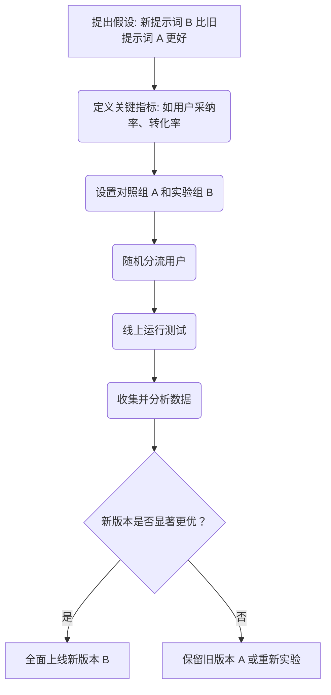

# 第十五章：迭代优化：A/B 测试与持续改进

在上一章，我们学会了如何为提示词的输出质量建立一套评估体系。但这仅仅是起点。真正的优化来自于持续的、由数据驱动的迭代。当你面对两个看似都不错的提示词版本时，例如一个更简洁，一个更详细，你如何科学地判断哪一个在真实的用户环境中表现更好呢？

答案就是 **A/B 测试**。这是一种在互联网产品开发中被广泛使用的、严谨的实验方法，它同样也是我们优化提示词、实现持续改进的利器。

## 为什么要进行 A/B 测试？

离线的评估（使用黄金评估集）可以帮助我们保证提示词的下限，确保其输出的准确性和格式合规。但是，它无法完全模拟真实用户千变万化的需求和偏好。一个在离线评估中得分最高的提示词，在线上环境中不一定最受欢迎。

A/B 测试的核心思想是：**让真实的用户用他们的行为来投票**。

具体来说，就是将线上用户流量随机地分成两组（或多组）：

-   **A 组（对照组）**：继续使用旧版本的提示词。
-   **B 组（实验组）**：使用我们想要验证的新版本提示词。

在系统运行一段时间后，我们通过对比两组用户在关键指标上的表现差异，就能用真实数据来判断新版本是否真的优于旧版本。

## A/B 测试的设计与实施

一个规范的 A/B 测试，就像一次严谨的科学实验，遵循着清晰的生命周期。我们可以通过一个流程图来理解它。



让我们来详细拆解其中的关键步骤：

1.  **提出假设 (Hypothesis)**：这是实验的起点，必须是一个明确的、可被验证的假设。例如：“通过在 AI 旅行规划师的提示词中增加‘充满激情和创意’的风格描述，可以提高用户对生成行程的‘保存率’。”

2.  **定义关键指标 (Key Metrics)**：你用什么来衡量“更好”？这个指标必须是可量化的。它可以是直接的业务指标（如商品推荐的“购买转化率”），也可以是间接的用户行为指标（如对 AI 回答点“赞”/“踩”的比率、用户平均会话轮次、功能留存率等）。

3.  **随机分流 (Random Assignment)**：“随机”和“均匀”是 A/B 测试的灵魂。我们必须确保每个用户都有同等的机会被分到 A 组或 B 组，这样才能排除用户群体差异带来的偏见，确保实验结果的公正性。

4.  **收集并分析数据**：在实验运行期间（通常至少需要一周，以覆盖一个完整的用户行为周期），持续收集两组用户的关键指标数据。实验结束后，我们需要运用统计学工具来分析这些数据。

> **统计学小贴士**
>
> 在分析结果时，我们通常会关注“统计显著性”（Statistical Significance）。一个结果具有统计显著性，意味着两组数据的差异不太可能是由随机的偶然因素造成的。我们常用 **p-value** 来衡量这一概率，通常当 p-value 小于 0.05 时，我们便认为该结果是统计显著的，即新版本带来的提升是真实有效的。

## 案例研究：优化一个“旅行计划生成器”

让我们通过一个完整的案例，来看看 A/B 测试在实践中是如何运作的。

**场景**：我们有一个 AI 旅行计划生成器，它能为用户生成旅行计划。但我们收到的用户反馈显示，很多人觉得生成的计划“中规中矩，不够有趣”。

**我们的假设**：通过调整提示词，赋予 AI 一个更具创意和探索精神的人设，可以提升生成计划的吸引力，从而提高用户的“保存率”。

**A/B 测试设计：**

-   **版本 A (对照组)**：
    ```prompt
    你是一个旅行规划助手，为用户生成一个[地点]的[天数]日游计划。
    ```

-   **版本 B (实验组)**：
    ```prompt
    你是一位充满激情和创意的旅行探险家，为用户打造一个充满惊喜和本地特色的[地点][天数]日游行程。你的计划应该包含至少两个只有当地人才知道的小众景点。
    ```

-   **关键指标**：用户对生成的行程点击“保存”按钮的比率。

-   **实施**：我们将 50% 的用户流量分配给版本 A，另外 50% 分配给版本 B，实验运行两周。

**结果分析：**

实验结束后，我们收集到以下数据：

| 版本 | 访问用户数 | 保存行程数 | 保存率 |
| :--- | :--- | :--- | :--- |
| **A (对照组)** | 10,150 | 1,523 | 15.0% |
| **B (实验组)** | 9,980 | 2,196 | 22.0% |

数据清晰地显示，版本 B 的保存率（22.0%）远高于版本 A（15.0%）。经过统计显著性检验，p-value 小于 0.01。这给了我们充足的信心得出结论：**版本 B 的提示词显著优于版本 A**。

于是，我们决定将所有用户流量都切换到版本 B，完成了一次由数据驱动的、成功的提示词优化。

> **工程实践提醒**
>
> 在真实的工程环境中，A/B 测试通常由专门的实验平台（如 VWO, Optimizely，或公司自研平台）来支持，这些平台能方便地进行流量分割、数据收集和结果分析。

## 动手练习

假设你正在开发一个 AI 代码助手，你的目标是提高 AI 生成代码片段的“采纳率”（即用户复制并粘贴到自己代码中的比率）。

请为此设计一个 A/B 测试方案：

1.  **提出你的核心假设。**
2.  **写出两个你希望进行对比的、不同版本的提示词（版本 A 和版本 B）。**
3.  **确定你将用于衡量的关键指标。**

这个练习将帮助你将 A/B 测试的思想，应用到你自己的项目中。记住，最优秀的产品，总是在一次又一次的微小实验和持续改进中诞生的。提示词工程，亦是如此。