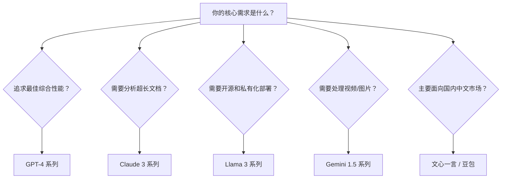

# 主流大型语言模型（LLM）概览

欢迎来到一个“百模大战”的时代。

如果说大型语言模型（LLM）是新时代的“超级大脑”，那么此刻的 AI 领域，正上演着一场精彩的“群雄逐鹿”。各大科技巨头、研究机构和开源社区，都纷纷推出了自己的得意之作，每一个都身怀绝技，试图在这场技术变革中占据一席之地。

面对层出不穷的模型，你可能会感到眼花缭乱。但别担心，就像游览一座巨大的城市需要地图一样，我们可以从几个最著名、最有影响力的“家族”入手，来快速理解整个 LLM 的版图。

选择合适的模型，是提示词工程成功的第一步，如同能工巧匠需要为不同的任务挑选最趁手的工具。了解它们各自的性格、优势和局限，将让你事半功倍。接下来，就让我们一起巡礼当今世界最主流的几个 LLM 家族。

---

## 主流 LLM 家族巡礼

为了让你更轻松地记住它们，我为每个模型家族都设定了一个鲜明的“人设”。

### 1. OpenAI 的 GPT 系列 (GPT-3.5, GPT-4)

- **人设：行业标杆的全能优等生**

GPT 系列，特别是 GPT-4，是当之无愧的“全能冠军”。它在几乎所有方面都表现出色，是整个行业的标杆。

- **核心特点**：
  - **综合实力强**：无论是在复杂的逻辑推理、严谨的代码生成，还是在流畅的语言理解和内容创作上，GPT-4 都长期处于领先地位。当你不知道该用哪个模型时，选择它通常是最稳妥的“默认安全选项”。
  - **生态系统成熟**：作为市场的开创者，GPT 拥有最庞大、最成熟的开发者生态。无数的应用、插件和第三方工具都基于它的 API 构建，你能轻易地找到丰富的资源和社区支持。
- **主要短板**：
  - **闭源**：你无法得知其内部的具体工作原理，也无法进行私有化部署。
  - **成本较高**：作为顶级性能的代表，其 API 调用成本也相对较高。
- **适用场景**：
  - 需要高度创造性和逻辑性的复杂任务。
  - 专业领域的代码生成、解释与调试。
  - 撰写高质量的报告、文章和技术文档。

### 2. Anthropic 的 Claude 系列 (Claude 3 Sonnet, Opus)

- **人设：深思熟虑的文学家与分析师**

如果说 GPT 是一个理科状元，那么 Claude 则更像一位博闻强识、心思缜密的文科大家。

- **核心特点**：
  - **超长文本处理**：Claude 系列以其巨大的上下文窗口（Context Window）而闻名。最新的 Claude 3 Opus 模型支持高达 20 万 Token 的上下文，相当于一本厚厚的书籍。这使得它在阅读、分析和总结长篇文档（如公司财报、法律合同、学术论文）方面无人能及。
  - **注重安全与伦理**：Anthropic 公司由前 OpenAI 员工创立，他们尤其强调 AI 的安全性。通过“宪法 AI（Constitutional AI）”技术，Claude 的输出被设计得更安全、无害，并努力遵循道德伦理，这让它在需要与公众进行大规模对话的场景中更值得信赖。
  - **优雅的写作风格**：许多用户称道 Claude 在文学创作和长文写作方面的风格，认为其文字更显优雅和连贯。
- **适用场景**：
  - 对几十上百页的 PDF 进行快速摘要和问答。
  - 法律合同审阅、金融财报分析。
  - 需要细腻情感和优雅文笔的文学创作、市场文案撰写。

### 3. Meta 的 Llama 系列 (Llama 3)

- **人设：开源社区的超级明星**

Llama 系列是开源世界的一面旗帜，由社交媒体巨头 Meta（原 Facebook）推出，它代表了 AI 技术的民主化力量。

- **核心特点**：
  - **开源力量**：Llama 3 是目前性能最强大的开源模型系列之一，任何开发者都可以免费下载、使用和修改它。这极大地推动了 AI 技术的普及和创新研究。
  - **高度可定制**：因为开源，你可以将 Llama 模型部署在自己的服务器上，实现数据的私有化。更重要的是，你可以用自己的数据对它进行“微调（Fine-tuning）”，训练出满足特定业务需求的专属模型。
  - **活跃的社区**：围绕 Llama 已经形成了一个充满活力的全球性开源社区，无数开发者在上面分享经验、贡献代码、发布自己微调后的新模型。
- **适用场景**：
  - 学术研究与 AI 技术探索。
  - 对数据隐私有严格要求的企业内部应用（如智能客服、内部知识库）。
  - 需要深度定制以适应特定领域的商业应用（如医疗、金融、法律的专业问答系统）。

### 4. Google 的 Gemini 系列 (Gemini Pro, Gemini 1.5)

- **人设：天生的多模态艺术家**

由搜索巨头 Google 推出的 Gemini，从诞生之初就被寄予厚望，它的最大特色是“原生多模态”。

- **核心特点**：
  - **原生多模态**：与其它模型主要处理文本不同，Gemini 的设计初衷就是为了同时理解和处理多种信息格式。你可以直接向它“输入”文本、图片、音频甚至视频，它能像人类一样综合理解这些信息并作出回应。
  - **海量上下文与谷歌生态**：Gemini 1.5 Pro 提供了惊人的 100 万 Token 上下文窗口，进一步增强了其处理海量信息的能力。同时，作为 Google 家族的一员，它与 Google 搜索、YouTube、Google Workspace 等服务有着天然的整合优势，潜力巨大。
- **适用场景**：
  - **视频内容分析**：快速为一段长达一小时的演讲视频生成摘要和章节目录。
  - **图表信息提取**：直接从一张复杂的财务报表截图中提取关键数据。
  - **构建能“看”和“听”的智能应用**：例如，为视障人士描述周围环境的应用，或实时翻译视频通话的应用。

---

## 国内代表模型简介

除了上述国际巨头，国内的科技公司也在积极布局，并推出了许多优秀的模型。它们最大的优势在于对中文语言和中国文化的深刻理解。

- **百度的“文心一言”**：作为国内最早投入研发的大模型之一，文心一言在中文理解、中国古诗词创作、以及与百度搜索生态的结合方面具有独特优势。
- **字节跳动的“豆包”**：依托于抖音、今日头条等产品背后的技术积累，豆包大模型在多媒体内容理解和生成方面表现出色，并且通过“豆包”App 提供了免费、易用的服务，拥有庞大的用户基础。

对于主要面向国内市场、需要深度理解中文语境和文化背景的应用，选择这些本土化模型通常是更明智的选择。

---

## 如何选择你的第一个 LLM？

面对众多选择，如何找到最适合你的那一个？下面这个简单的决策流程图可以帮助你快速做出判断：

**决策清单**

| 维度 | GPT-4 | Claude 3 | Llama 3 | Gemini 1.5 | 文心一言/豆包 |
| :--- | :--- | :--- | :--- | :--- | :--- |
| **开发者** | OpenAI | Anthropic | Meta | Google | 百度/字节跳动 |
| **是否开源** | 否 | 否 | 是 | 否 | 否 |
| **核心优势** | 综合性能最强 | 超长文本处理 | 开源、可定制 | 原生多模态 | 中文理解深入 |
| **最适用场景** | 复杂推理、代码 | 长文分析、写作 | 私有部署、微调 | 视频/图片分析 | 国内市场应用 |

记住，模型的世界日新月异，今天的“冠军”可能在明天就被新的挑战者超越。但通过理解它们的核心设计哲学和优势领域，你就拥有了一张能够长期指引你的“寻宝图”。在本书的后续章节，我们还将探讨如何通过巧妙的提示词，将这些模型的潜力发挥到极致。