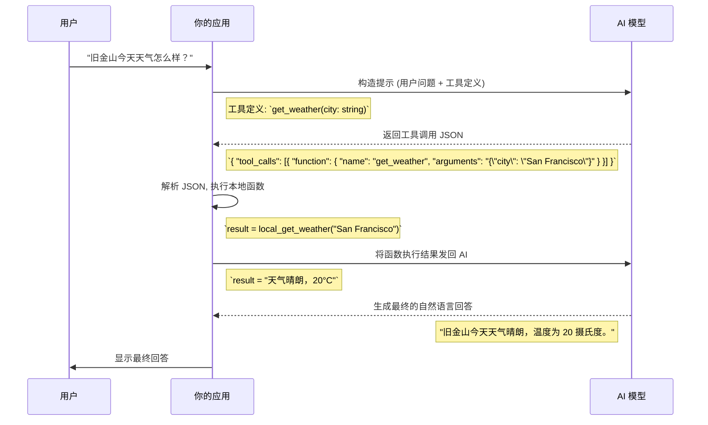

# A - 行动触发：让 AI 的产出直接可用

P.I.C.A. 框架的最后一块拼图是 **A (Action)**，即行动触发。它是我们将 AI 无缝融入自动化流程的关键。前面三个步骤（Persona, Instruction, Context）确保了 AI 能够“思考”得正确，而“行动触发”则确保它能够“表达”得精确——以一种机器可以理解和执行的方式。

## 1. 终极目标：从“供人阅读”到“供机执行”

想象一下，你让 AI 分析一份市场趋势报告。它可能会给你一段洋洋洒洒、文采飞扬的分析文章：

> “根据最新数据，全球电动汽车市场在过去一年中实现了 40% 的惊人增长。主要的市场领导者包括特斯拉、比亚迪和大众集团。消费者对续航里程和充电基础设施的关注度持续上升……”

这段文字对于人类来说信息量很足，但如果你的程序需要从这段话中自动提取关键数据，比如“增长率”或“主要竞争对手”，就会变得异常困难。这是一个典型的“供人阅读”的非结构化文本。

“行动触发”的目标，就是将这种文本转化为结构化的、可预测的输出，使其能够直接作为下一个程序的输入，实现端到端的自动化。

## 2. 指定输出格式：给 AI 的表达上“枷锁”

要让 AI 的输出变得可供机器执行，最直接的方法就是强制它按照我们指定的格式进行“表达”。

### 2.1. JSON：现代应用的首选语言

JSON (JavaScript Object Notation) 是目前最通用、最高效的结构化数据格式。要求 AI 输出 JSON，是实现自动化的首选方案。

> **场景**：从一段新闻中提取关键信息。
> 
> **提示**：
> “你是一位信息提取专家。请从以下新闻报道中提取作者、标题和三个核心要点。
> 
> **新闻文本**：
> ‘[...粘贴新闻内容...]’
> 
> **行动指令**：
> 请将你的分析结果格式化为一个**严格的 JSON 对象**。该对象**必须**包含以下三个字段：
> - `author` (string)
> - `title` (string)
> - `key_takeaways` (array of strings)
> 
> **不要**在 JSON 对象之外添加任何解释性文字。”

通过这样的指令，AI 的输出将不再是自然语言，而是一个可以直接被 Python、JavaScript 或任何编程语言解析的干净的 JSON 对象。

### 2.2. Markdown 表格：清晰对比信息

当你需要对比多项信息的优缺点时，Markdown 表格是一个非常直观的选择。

> **场景**：对比三款智能手机。
> 
> **提示**：
> “...请详细对比 iPhone 15 Pro, Samsung Galaxy S24 Ultra, 和 Google Pixel 8 Pro 的主要优缺点。
> 
> **行动指令**：
> 请使用 **Markdown 表格**来呈现你的对比结果。表格应包含三列：‘特性’、‘优点’和‘缺点’。”

### 2.3. 其他格式（XML, YAML 等）

根据你的技术栈需求，你也可以要求 AI 输出其他格式，如 XML 或 YAML。

> **场景**：生成一个简单的 XML 配置文件。
> 
> **提示**：
> “...请为应用生成一个配置文件。
> 
> **行动指令**：
> 输出必须是 **XML 格式**，根元素为 `<config>`，包含 `<user>` 和 `<port>` 两个子元素。”

## 3. 函数/工具调用：赋予 AI “行动”的能力

指定输出格式是让 AI “说”出结构化的话，而**函数/工具调用 (Function/Tool Calling)** 则是让 AI 直接告诉我们它想“做什么”。这是构建真正智能体（Agent）的核心技术。

其基本原理是：
1.  你在提示中向 AI 描述一个或多个你的程序可以执行的“工具”（函数）。
2.  AI 理解用户的意图后，不会直接回答问题，而是生成一个包含它想调用的工具名称和所需参数的 JSON 对象。
3.  你的程序捕获这个 JSON 对象，然后实际执行对应的本地函数。
4.  （可选）将函数执行的结果再返回给 AI，让它根据结果生成最终的自然语言回答。

让我们用一个完整的流程图和示例来解释这一切。



### 示例步骤

**第一步：定义你的工具**

你需要用一种 AI 能理解的格式（通常是 JSON Schema）来描述你的工具。

```json
{
  "name": "get_weather",
  "description": "获取指定城市的天气信息",
  "parameters": {
    "type": "object",
    "properties": {
      "city": {
        "type": "string",
        "description": "城市名称, e.g., San Francisco"
      }
    },
    "required": ["city"]
  }
}
```

**第二步：将用户问题和工具定义一起发送给 AI**

你的应用需要将用户的原始问题和你在上一步定义的工具列表一起发送给 AI 模型。

**第三步：解析模型的输出**

AI 模型如果判断出用户的意图需要使用工具，它就会返回一个类似下面这样的 JSON 对象，而不是直接回答问题。

```json
{
  "tool_calls": [
    {
      "function": {
        "name": "get_weather",
        "arguments": "{\"city\": \"San Francisco\"}"
      }
    }
  ]
}
```

**第四步：执行本地函数并返回结果**

你的代码需要解析这个 JSON，确认 `name` 是 `get_weather`，然后从 `arguments` 中提取出 `city` 参数，去调用你本地真正的天气查询函数。得到结果后，再将其发送回 AI，AI 就会用自然语言总结并回答用户。

## 4. 边界与失败案例

- **格式错误**：有时 AI 可能不会严格遵循你要求的格式。你可以在指令中增加强调（如“**严格**”、“**必须**”），并在代码中加入容错处理逻辑，例如，如果 JSON 解析失败，就将错误信息返回给 AI，让它“自我修正”。
- **无效的函数调用**：AI 可能会“幻觉”出一个不存在的函数名或错误的参数。你的代码必须有一个白名单机制，只执行你明确定义过的安全函数。

## 5. 总结与练习

“行动触发”是连接 AI 智能与物理世界或数字世界的桥梁。掌握它，意味着你从一个“提示词使用者”进化为了一个“AI 应用构建者”。

### 输出格式对比

| 格式 | 优点 | 缺点 | 适用场景 |
| :--- | :--- | :--- | :--- |
| **JSON** | 机器可读性极佳，通用性强 | 人类可读性一般 | API 通信，程序间数据交换 |
| **Markdown** | 人类可读性极佳，结构清晰 | 机器解析相对复杂 | 生成报告，对比信息，内容展示 |
| **XML** | 格式严谨，支持命名空间 | 语法冗长 | 旧系统集成，特定行业标准 |

### 练习

**场景**: 我需要一个能从特定 URL 下载图片并保存到本地的工具。

1.  请尝试用 JSON Schema 来定义一个名为 `download_image` 的工具，它应包含 `url` 和 `save_path` 两个参数。
2.  请编写一个提示，当用户说“帮我把这张图 `[图片URL]` 下载到我的桌面”时，引导 AI 能正确地生成调用该工具的 JSON。