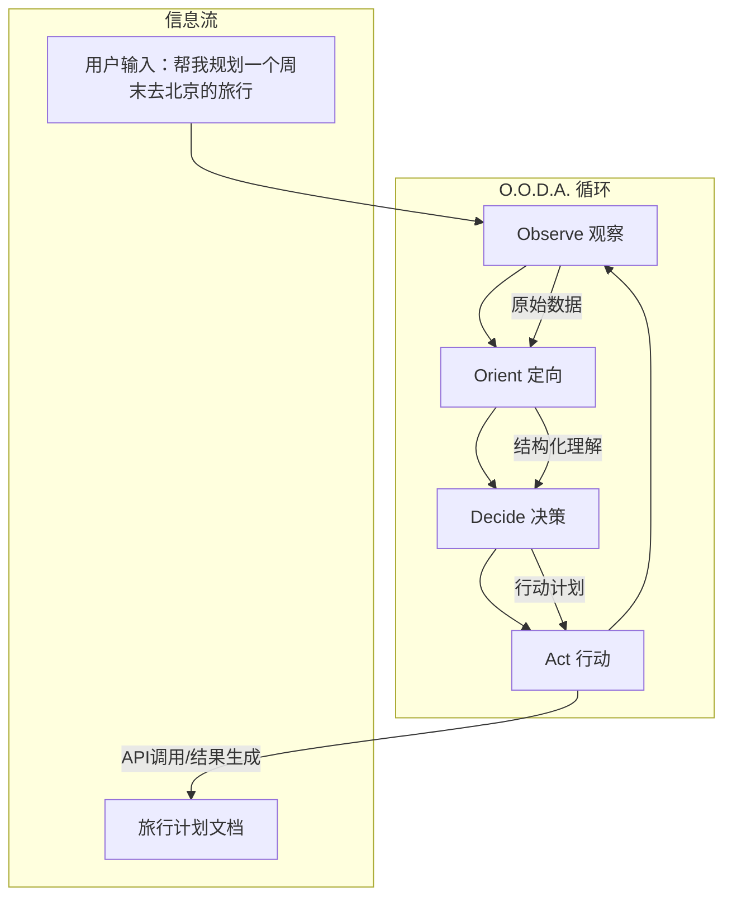

# 从模糊到精确：智能体与 O.O.D.A. 框架

在前面的章节中，我们学会了如何通过“角色-任务-要求”三要素，向 AI 下达一个相对清晰的指令。但现实世界的需求，往往是模糊、复杂且充满变化的。当用户提出的不是一个可以直接执行的任务，而是一个宽泛的目标时，AI 该如何思考和行动？

比如，当一个用户对 AI 说：

> “我心情不好，想找点乐子。”

或者一个产品经理提出一个需求：

> “我想要一个‘好’的 App。”

面对这样模糊的输入，一个简单的“问答式”AI 可能会束手无策。而一个更高级的“**智能体（Agent）**”，则需要一套强大的决策框架，来将这些模糊的意图，一步步转化为精确、可执行的任务。这套框架，就是我们本章要探讨的核心——**O.O.D.A. 循环**。

O.O.D.A. 循环最初是由美国空军上校约翰·博伊德提出的一个军事决策理论，用于描述战斗机飞行员如何在瞬息万变的空战中取得优势。其核心思想在于，谁能更快、更准地完成“**观察-定向-决策-行动**”的循环，谁就能掌握战场的主动权。这个理论如今被广泛应用于商业、法律、科技等多个领域，对于我们理解和构建高级 AI 智能体，同样具有深刻的启发意义。

---

## O.O.D.A. 循环：智能体的“思考”流程

O.O.D.A. 循环为智能体提供了一个从感知环境到采取行动的完整闭环。让我们通过一个具体的例子——“帮我规划一个周末去北京的旅行”——来拆解智能体是如何运用这个框架进行思考的。



### 1. Observe (观察)：收集原始信息

**观察**是智能体与世界交互的第一步。它通过各种传感器（对于 AI 来说，就是 API、用户输入框、文件读取等接口）来被动地接收和收集原始数据。

在我们的旅行规划案例中，智能体在观察阶段收集到的信息可能如下（以 JSON 格式表示）：

```json
{
  "userInput": "帮我规划一个周末去北京的旅行",
  "userProfile": {
    "location": "上海",
    "travel_preferences": ["历史古迹", "美食"],
    "budget": "中等"
  },
  "currentTime": "2024-08-15T10:00:00Z"
}
```

在这个阶段，信息是原始的、未经处理的。智能体只是一个忠实的记录员，它记录了用户的直接请求、用户的个人偏好（可能来自历史对话或用户画像系统）以及当前的时间。

### 2. Orient (定向)：理解与分析

**定向**是 O.O.D.A. 循环中最核心、也最复杂的一步。它决定了智能体的“智慧”程度。在这一步，智能体需要将观察到的、零散的原始信息，与自身的知识库、上下文和目标相结合，进行深入的分析和理解，最终形成对当前局势的**结构化判断**。

这是**从模糊到精确**的关键转化过程。

继续我们的例子，智能体需要对观察到的信息进行“定向”处理：

1.  **意图识别**：从“帮我规划一个周末去北京的旅行”中，识别出用户的核心意图是 `plan_trip`。
2.  **实体提取**：提取出关键信息，如目的地 `北京`，时间 `周末`。
3.  **信息补全**：结合用户画像 `userProfile`，将出发地补全为 `上海`，并将用户的偏好 `历史古迹` 和 `美食` 纳入规划考虑。
4.  **形成判断**：综合所有信息，形成一个清晰、结构化的内部判断。

定向阶段完成后，智能体内部形成的数据结构可能如下：

```json
{
  "intent": "plan_trip",
  "parameters": {
    "destination": "北京",
    "time": "weekend",
    "departure": "上海",
    "preferences": ["历史古迹", "美食"],
    "budget": "中等"
  },
  "analysis": "用户希望得到一份从上海出发，前往北京的详细周末旅行计划，计划需要侧重于历史古迹和美食体验，且预算为中等水平。"
}
```

看到变化了吗？模糊的用户输入，在定向阶段后，变成了一个清晰、结构化、信息完整的内部任务描述。

### 3. Decide (决策)：制定行动计划

有了清晰的判断，**决策**就变得水到渠成。在这一步，智能体需要基于定向阶段形成的结构化判断，制定一个具体的、可执行的**行动计划（Plan）**。

这个计划通常是一个由多个步骤组成的序列，每个步骤都可能是一个内部操作或一次外部工具的调用。

针对旅行规划任务，智能体的决策可能是一个包含多个行动的列表：

```json
[
  {
    "action": "search_flights",
    "params": { "from": "上海", "to": "北京", "date": "next_saturday" },
    "step": 1
  },
  {
    "action": "search_hotels",
    "params": { "city": "北京", "preferences": ["市中心", "靠近地铁"], "budget": "中等" },
    "step": 2
  },
  {
    "action": "find_attractions",
    "params": { "city": "北京", "tags": ["历史古迹"] },
    "step": 3
  },
  {
    "action": "find_restaurants",
    "params": { "city": "北京", "tags": ["美食", "特色小吃"] },
    "step": 4
  },
  {
    "action": "generate_itinerary",
    "params": { "data_from_steps": [1, 2, 3, 4] },
    "step": 5
  }
]
```

这个行动计划清晰地定义了智能体接下来要做的每一件事：查机票、订酒店、找景点、搜美食，最后综合所有信息生成最终的行程单。

### 4. Act (行动)：执行并与世界交互

**行动**是 O.O.D.A. 循环的最后一步，也是智能体真正“动手”的阶段。它会严格按照决策阶段制定的计划，一步步执行。

- **调用工具**：执行 `search_flights` 时，它会调用一个真实的机票查询 API。
- **与环境交互**：执行 `generate_itinerary` 时，它可能会在自己的“草稿本”（一个内部文件系统）上创建并编辑行程文档。
- **产生输出**：最终，它会将生成的完整旅行计划作为输出，呈现给用户。

行动的结果（比如 API 的返回值，或文件写入的成功与否）会成为下一次 O.O.D.A. 循环的**观察**输入。例如，如果查询机票的 API 返回“无直达航班”，智能体就会在新的循环中**观察**到这个新信息，重新**定向**（判断需要中转），做出新的**决策**（查询中转方案），并采取新的**行动**。

---

## 总结

O.O.D.A. 循环为我们提供了一个强大的心智模型，来理解智能体是如何处理从模糊到精确的任务的。它将一个复杂的认知过程，分解为了四个可管理、可设计的阶段。

| 阶段 | 输入 | 处理过程 | 输出 |
| :--- | :--- | :--- | :--- |
| **观察 (Observe)** | 原始、零散的数据 | 收集、记录 | 结构化的原始信息集合 |
| **定向 (Orient)** | 原始信息集合 | 分析、理解、关联、补全 | 对局势的结构化判断 |
| **决策 (Decide)** | 结构化判断 | 规划、排序、选择工具 | 一系列具体的行动步骤 |
| **行动 (Act)** | 行动步骤 | 执行、调用工具、与环境交互 | 任务结果与新的观察数据 |

通过精心设计智能体在每一个环节的行为，我们就能构建出真正强大、能够解决复杂现实问题的 AI 应用。在接下来的 P.I.C.A. 方法论中，我们将更深入地学习如何为智能体在定向、决策和行动的每一步，提供更精确的“指令”。

### 练习

现在，请你尝试将一个新的模糊需求——“**帮我写一个能监控网站价格变动的网络爬虫**”——分解为 O.O.D.A. 的四个步骤。思考一下，在每个步骤中，智能体需要观察什么信息？如何定向？做出怎样的决策？以及最终采取什么行动？