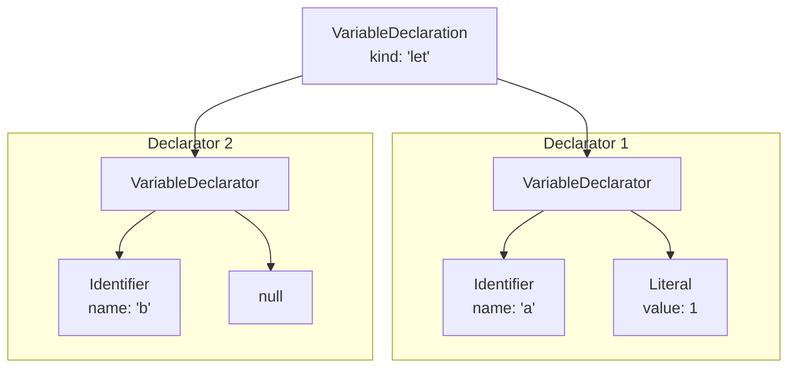

# 解析变量声明：`var`, `let`, `const`

在程序世界中，变量是存储和引用数据的基本单元。如果说语句是程序的骨架，那么变量就是流淌于其中的血液。在 JavaScript 中，我们主要使用 `var`、`let` 和 `const` 这三个关键字来声明变量。一个合格的解析器必须能够准确无误地理解它们。

```javascript
// 经典的 var 声明
var a = 1;

// ES6 引入的块级作用域声明
let name = "mini-acorn";

// 常量声明，必须初始化
const PI = 3.14;

// 单行声明多个变量
let x = 10, y = 20, z;
```

本章，我们的任务就是实现 `parseVarStatement` 方法，使其能够正确解析上述所有形式的变量声明，并生成符合 ESTree 规范的 AST。

## AST 结构剖析：声明与声明符

在深入代码之前，我们必须先厘清两个非常重要的概念：**声明 (Declaration)** 和 **声明符 (Declarator)**。

- **变量声明 (VariableDeclaration)**：指的是**整个**语句，从 `var`/`let`/`const` 开始，到分号或换行结束。例如，`let a = 1, b;` 就是一个完整的变量声明。
- **变量声明符 (VariableDeclarator)**：指的是声明中的**一部分**，即单个变量的声明。在 `let a = 1, b;` 中，`a = 1` 是一个声明符，`b` 是另一个声明符。

一个 `VariableDeclaration` 节点包含一个 `declarations` 数组，里面存放着一个或多个 `VariableDeclarator` 节点。

以下是 `let a = 1, b;` 的 AST 结构图：



## 统一入口：`parseVarStatement`

无论是 `var`、`let` 还是 `const`，它们的核心结构都是相似的：`关键字 声明符1, 声明符2, ...;`。因此，我们可以设计一个统一的入口函数 `parseVarStatement` 来处理它们。这个函数会接收一个 `kind` 参数，用于指明当前是哪种类型的声明。

它的核心逻辑如下：
1.  创建一个 `VariableDeclaration` 节点，并记录下 `kind` (`'var'`, `'let'` 或 `'const'`)。
2.  进入一个 `do...while` 循环，这个循环专门用来解析由逗号分隔的声明符列表。
3.  在循环中，调用 `parseVarDeclarator` 来解析单个声明符，并将其推入 `declarations` 数组。
4.  如果遇到逗号 `,`，则继续循环；否则，退出循环。
5.  最后，处理可选的分号，并返回 `VariableDeclaration` 节点。

```javascript
// src/parser/index.js

// ...
  parseVarStatement(kind) { // kind 会是 'var', 'let', 'const' 之一
    const node = new VariableDeclaration(this);
    node.kind = kind.label;

    this.expect(kind); // 消费掉 var/let/const 关键字

    node.declarations = [];
    do {
      // 循环解析每个声明符
      node.declarations.push(this.parseVarDeclarator());
    } while (this.eat(tt.comma)); // 如果遇到逗号，则继续

    // 处理可选的分号
    this.eat(tt.semi);

    return node;
  }
// ...
```

## 解析声明符：`parseVarDeclarator`

这个函数负责解析 `identifier = initializer` 这样的单元。它需要处理两种情况：有初始化表达式和没有初始化表达式。

```javascript
// src/parser/index.js

// ...
  parseVarDeclarator() {
    const node = new VariableDeclarator(this);

    // 1. 解析绑定标识符 (id)
    node.id = this.parseBindingAtom();

    // 2. 解析可选的初始化表达式 (init)
    if (this.eat(tt.eq)) { // 如果后面是 '=' 
      node.init = this.parseExpression(); // 等号右边是一个表达式
    } else {
      node.init = null;
    }

    return node;
  }
// ...
```

### 语义检查：`const` 必须初始化

`const` 声明的变量在定义时必须赋值。这是一个语法规则，属于**静态语义**的范畴。我们的解析器可以在解析过程中顺便完成这个检查。

最佳的检查位置就在 `parseVarDeclarator` 中。当发现一个变量没有初始化表达式时，我们只需检查当前的 `kind` 是否是 `'const'` 即可。

让我们来完善 `parseVarStatement`，将 `kind` 传递下去：

```javascript
// src/parser/index.js

// ...
  parseVarStatement(kind) {
    // ...
    do {
      node.declarations.push(this.parseVarDeclarator(kind)); // 传递 kind
    } while (this.eat(tt.comma));
    // ...
  }

  parseVarDeclarator(kind) {
    const node = new VariableDeclarator(this);
    node.id = this.parseBindingAtom();

    if (this.eat(tt.eq)) {
      node.init = this.parseExpression();
    } else {
      node.init = null;
      // 在这里进行语义检查
      if (kind === tt._const) {
        this.raise("'const' declarations must be initialized.");
      }
    }
    return node;
  }
// ...
```

## 绑定原子：`parseBindingAtom`

你可能注意到了 `parseBindingAtom` 这个新面孔。为什么不直接用 `this.parseIdentifier()` 呢？

这是为了**未来的扩展**。在 JavaScript 中，变量声明的左侧不一定是一个简单的标识符，它还可能是**解构模式**，例如 `let { name, age } = user;` 或 `let [x, y] = coords;`。

通过引入 `parseBindingAtom` 这个中间层，我们为未来支持解构赋值解析铺平了道路。在当前阶段，它的实现非常简单，就是解析一个标识符。

```javascript
// src/parser/index.js

// ...
  parseBindingAtom() {
    // 目前，绑定原子只支持标识符
    // 后续章节将在这里扩展，以支持对象和数组解构
    if (this.match(tt.name)) {
      return this.parseIdentifier(); // parseIdentifier 只负责创建 Identifier 节点
    }
    this.raise("Expected an identifier.");
  }

  parseIdentifier() {
    const node = new Identifier(this);
    node.name = this.value;
    this.nextToken();
    return node;
  }
// ...
```

## 集成与总结

现在，我们来定义本章所需的 AST 节点，并更新 `parseStatement` 的 `switch` 分支。

**1. 定义 AST 节点**

```javascript
// src/ast/node.js

// ... (已有节点)

export class VariableDeclaration extends Node {
  constructor(parser) {
    super(parser);
    this.type = "VariableDeclaration";
    this.kind = ''; // 'var', 'let', or 'const'
    this.declarations = [];
  }
}

export class VariableDeclarator extends Node {
  constructor(parser) {
    super(parser);
    this.type = "VariableDeclarator";
    this.id = null; // Identifier or BindingPattern
    this.init = null; // Expression or null
  }
}

export class Identifier extends Node {
  constructor(parser) {
    super(parser);
    this.type = "Identifier";
    this.name = '';
  }
}
```

**2. 更新 `parseStatement`**

```javascript
// src/parser/index.js

// ...
  parseStatement() {
    const startType = this.type;
    switch (startType) {
      // ... (其他 case)
      case tt._var: // 新增
      case tt._const:
      case tt._let:
        return this.parseVarStatement(startType);
      // ... (其他 case)
    }
  }
// ...
```

至此，我们成功地让解析器掌握了变量声明的解析能力。通过 `parseVarStatement` 和 `parseVarDeclarator` 的组合，我们优雅地处理了多种声明形式，并通过 `parseBindingAtom` 为未来做好了铺垫。更重要的是，我们首次在解析过程中加入了**语义检查**，让解析器变得更加“智能”。