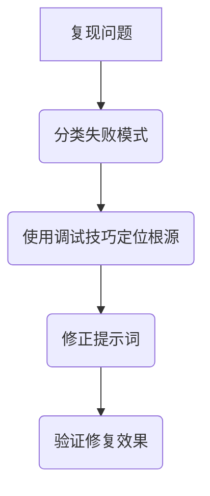

# 第十六章：调试艺术：错误分析与修正技巧

即使是最高明的提示词工程师，也总会遇到 AI 不按常理出牌的时刻。它可能突然输出一段格式混乱的文本，或者一本正经地胡说八道。当这种情况发生时，我们不应像无头苍蝇一样随机试错，而应像一位经验丰富的侦探，开启系统性的调试流程。

本章，我们将为你装备一套强大的调试工具和思维框架，让你能够优雅地诊断并修复提示词中的各种“疑难杂症”。

## 失败模式分类学：识别错误的“作案手法”

AI 的输出看似千奇百怪，但其犯错的模式往往有规律可循。学会识别这些常见的“作案手法”，是我们高效调试的第一步。

### 1. 指令冲突 (Instruction Conflict)

当你的提示词中包含相互矛盾的指令时，AI 就会陷入“左右为难”的境地。

-   **坏案例**：
    ```prompt
    请为我们的新产品写一段简洁的市场宣传语，并详细解释其中蕴含的每一个营销策略和技术细节。
    ```
    *点评：“简洁”与“详细解释”是根本上冲突的，模型不知道该优先满足哪一个。*

-   **修正后**：
    ```prompt
    请分两部分完成任务：
    1.  为我们的新产品写一段简洁的市场宣传语。
    2.  详细解释这段宣传语背后所蕴含的营销策略。
    ```
    *点评：将任务分解，消除指令的二义性。*

### 2. 情境缺失或错误 (Missing/Wrong Context)

模型没有人类的记忆和背景知识，你认为“理所当然”的信息，对它来说却是完全未知的。

-   **坏案例**：
    ```prompt
    根据我们上次会议的决定，总结一下项目的下一步计划。
    ```
    *点评：AI 并不知道你们会议的任何内容，它唯一的选择就是“幻觉”出一个看似合理的计划。*

-   **修正后**：
    ```prompt
    [会议纪要]
    -   A 同学负责在周三前完成用户调研。
    -   B 同学负责设计新的 UI 草图。
    -   ...

    ---
    根据以上会议纪要，以项目经理的口吻，为团队总结下一步的行动计划。
    ```
    *点评：提供必要的、准确的上下文信息。*

### 3. 角色混淆 (Persona Confusion)

AI 未能很好地代入你指定的角色，或者在多角色对话中发生混乱。

-   **坏案例**：
    ```prompt
    你现在是一位严厉的、批判性的代码审查专家。请审查以下代码。
    
    [代码...]
    ```
    *AI 输出：“这段代码写得很好，结构清晰，变量命名也很规范！”*
    *点评：模型可能因为其基础训练中的“乐于助人”倾向，而无法完全扮演一个“严厉”的角色。*

-   **修正后**：
    ```prompt
    你是一位极其严厉、注重细节、追求完美的资深代码审查专家。你的任务是找出以下代码中所有潜在的问题，无论多小。请用挑剔、不留情面的口吻，逐一列出你发现的每一个问题。
    
    [代码...]
    ```
    *点评：通过更具体、更强烈的描述来强化角色设定。*

### 4. 输出格式漂移 (Format Drift)

AI 开始时遵循了你要求的格式（如 JSON），但在后续的生成中逐渐偏离，混入了其他无关内容。

-   **坏案例**：
    ```prompt
    请以 JSON 数组的格式，列出三个推荐的旅游城市。
    ```
    *AI 输出：“当然！这里是三个推荐的城市：
    ```json
    [
      {"city": "巴黎", "reason": "浪漫之都"},
      {"city": "京都", "reason": "古都风情"},
      {"city": "罗马", "reason": "永恒之城"}
    ]
    ```
    希望你喜欢！”*
    *点评：在 JSON 前后增加了多余的对话性文本，导致程序无法直接解析。*

-   **修正后**：
    ```prompt
    请严格按照 JSON 数组的格式，列出三个推荐的旅游城市。不要包含任何解释、注释或额外的文本，只输出纯粹的 JSON 对象。
    ```
    *点评：通过明确的约束条件，杜绝格式之外的任何输出。*

## 核心调试技术：你的侦探工具箱

识别了问题类型后，我们需要更精准的工具来定位问题的根源。

### 1. 最小可复现示例 (Minimal Reproducible Example)

这与传统软件调试中的“代码简化”如出一辙。其目标是将一个长而复杂的提示词，逐步简化为一个只包含导致问题部分的最短版本，从而隔离变量，定位根源。

**操作步骤：**

1.  **复制**：完整复制你那条长长的、出了问题的提示词。
2.  **简化**：逐句、逐个约束地删除或简化内容。
3.  **重跑**：每删除一次，就重新运行，观察问题是否还存在。
4.  **定位**：当你删除了某一部分后问题消失了，那么被删除的部分很可能就是问题的根源（或之一）。

### 2. 思维链分析 (Chain-of-Thought Analysis)

这相当于在调试代码时打印日志（`console.log`）。我们强制 AI 在给出最终答案前，先输出其"思考过程"，从而暴露其逻辑上的跳跃或错误假设。

**关键指令**：在你的提示词结尾，加上一句："**在回答问题之前，请先一步一步地分析你的思考过程。**"

-   **场景**：你要求 AI 计算一个数学题，但它给出了错误答案。
-   **使用思维链分析后，AI 的输出可能如下**：
    > **思考过程：**
    > 1.  首先，题目要求计算 A 队的总分。A 队得了 3 个三分球，是 3 * 3 = 9 分。
    > 2.  然后，计算 A 队的二分球得分，是 5 * 2 = 10 分。
    > 3.  接着，计算 B 队的总分。B 队得了 2 个三分球，是 2 * 3 = 6 分。
    > 4.  哦，我发现我跳过了 A 队的罚球。我应该先完成 A 队的计算。A 队的罚球是 7 分。
    > 5.  所以 A 队的总分是 9 + 10 + 7 = 26 分。
    > 6.  现在计算 B 队的二分球，是 8 * 2 = 16 分，罚球是 5 分。
    > 7.  B 队的总分是 6 + 16 + 5 = 27 分。
    > 8.  比较两队得分，27 > 26，所以 B 队得分更高。
    >
    > **最终答案：** B 队得分更高。

通过这个“思考过程”，我们可以清晰地看到模型是如何一步步进行推理，以及它是否在某一步理解错了你的意图或依赖了错误的知识。

### 3. 分块测试 (Component-wise Testing)

这类似于软件测试中的“单元测试”。我们可以将 P.I.C.A. 模型中的每个部分（Persona, Instruction, Context, Action）分开，逐一测试，看是哪个环节出了问题。

**操作步骤：**

1.  **只用 `Instruction` 测试**：确保最核心的任务指令能被正确执行。
2.  **加入 `Persona`**：看模型的风格、语气是否符合角色设定。
3.  **加入 `Context`**：看模型是否能正确理解和利用你提供的背景信息。
4.  **最后加入 `Action`**：看模型是否能按要求的格式输出。

如果在哪一步出现了问题，你就能把怀疑范围大大缩小。

## 调试流程总结

一个系统性的调试流程可以总结如下：



> **处理随机性**
>
> 有时，即使是同一个提示词，由于模型的随机性（由 `temperature` 参数控制），问题也难以稳定复现。在调试时，一个有效的技巧是**将 `temperature` 设置为一个很低的值（如 0 或 0.1）**，这会大大降低输出的随机性，帮助你更稳定地复现和定位问题。

## 动手练习

作为一名提示词侦探，请分析以下案例：

-   **有问题的提示词**：
    ```prompt
    你是一个专业的营养师。根据下面的用户信息，为他生成一份 JSON 格式的晚餐建议，包含菜名和卡路里。用户对海鲜过敏。
    
    用户信息：{ "name": "张三", "goal": "减脂" }
    ```

-   **糟糕的输出**：
    > “好的，张三！为了帮助你减脂，我推荐一份美味的‘香煎三文鱼’，大约 400 卡路里。”

请使用本章学到的至少两种技术来分析问题可能出在哪里，并给出你的修改建议。