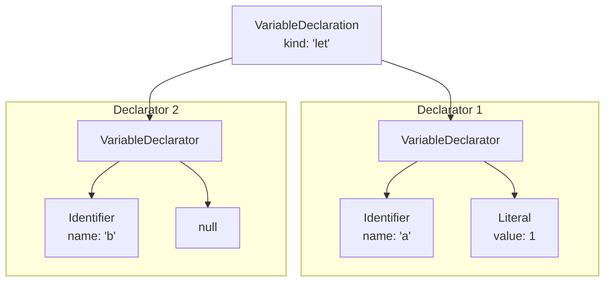

# Parsing Variable Declarations: `var`, `let`, `const`

In the world of programming, variables are the fundamental units for storing and referencing data. If statements are the skeleton of a program, then variables are the blood flowing through it. In JavaScript, we mainly use three keywords—`var`, `let`, and `const`—to declare variables. A qualified parser must be able to accurately understand them.

```javascript
// Classic var declaration
var a = 1;

// ES6 introduced block-scoped declarations
let name = "mini-acorn";

// Constant declaration, must be initialized
const PI = 3.14;

// Multiple variable declarations in one line
let x = 10, y = 20, z;
```

In this chapter, our task is to implement the `parseVarStatement` method so it can correctly parse all the above forms of variable declarations and generate AST that conforms to the ESTree specification.

## AST Structure Analysis: Declaration and Declarator

Before diving into the code, we must clarify two very important concepts: **Declaration** and **Declarator**.

- **VariableDeclaration**: Refers to the **entire** statement, from `var`/`let`/`const` to the semicolon or newline. For example, `let a = 1, b;` is a complete variable declaration.
- **VariableDeclarator**: Refers to **part** of the declaration, i.e., the declaration of a single variable. In `let a = 1, b;`, `a = 1` is one declarator, and `b` is another declarator.

A `VariableDeclaration` node contains a `declarations` array that stores one or more `VariableDeclarator` nodes.

Here's the AST structure diagram for `let a = 1, b;`:



## Unified Entry: `parseVarStatement`

Whether it's `var`, `let`, or `const`, their core structure is similar: `keyword declarator1, declarator2, ...;`. Therefore, we can design a unified entry function `parseVarStatement` to handle them. This function will receive a `kind` parameter to indicate which type of declaration it is.

Its core logic is as follows:
1. Create a `VariableDeclaration` node and record the `kind` (`'var'`, `'let'`, or `'const'`).
2. Enter a `do...while` loop specifically designed to parse comma-separated declarator lists.
3. In the loop, call `parseVarDeclarator` to parse a single declarator and push it into the `declarations` array.
4. If a comma `,` is encountered, continue the loop; otherwise, exit the loop.
5. Finally, handle the optional semicolon and return the `VariableDeclaration` node.

```javascript
// src/parser/index.js

// ...
  parseVarStatement(kind) { // kind will be one of 'var', 'let', 'const'
    const node = new VariableDeclaration(this);
    node.kind = kind.label;

    this.expect(kind); // consume the var/let/const keyword

    node.declarations = [];
    do {
      // loop to parse each declarator
      node.declarations.push(this.parseVarDeclarator());
    } while (this.eat(tt.comma)); // if comma is encountered, continue

    // handle optional semicolon
    this.eat(tt.semi);

    return node;
  }
// ...
```

## Parsing Declarator: `parseVarDeclarator`

This function is responsible for parsing units like `identifier = initializer`. It needs to handle two cases: with initialization expression and without initialization expression.

```javascript
// src/parser/index.js

// ...
  parseVarDeclarator() {
    const node = new VariableDeclarator(this);

    // 1. Parse binding identifier (id)
    node.id = this.parseBindingAtom();

    // 2. Parse optional initialization expression (init)
    if (this.eat(tt.eq)) { // if followed by '=' 
      node.init = this.parseExpression(); // right side of equals is an expression
    } else {
      node.init = null;
    }

    return node;
  }
// ...
```

### Semantic Check: `const` Must Be Initialized

Variables declared with `const` must be assigned a value when defined. This is a syntax rule belonging to the category of **static semantics**. Our parser can perform this check during the parsing process.

The best place for this check is in `parseVarDeclarator`. When we find a variable without an initialization expression, we just need to check if the current `kind` is `'const'`.

Let's improve `parseVarStatement` to pass the `kind` down:

```javascript
// src/parser/index.js

// ...
  parseVarStatement(kind) {
    // ...
    do {
      node.declarations.push(this.parseVarDeclarator(kind)); // pass kind
    } while (this.eat(tt.comma));
    // ...
  }

  parseVarDeclarator(kind) {
    const node = new VariableDeclarator(this);
    node.id = this.parseBindingAtom();

    if (this.eat(tt.eq)) {
      node.init = this.parseExpression();
    } else {
      node.init = null;
      // perform semantic check here
      if (kind === tt._const) {
        this.raise("'const' declarations must be initialized.");
      }
    }
    return node;
  }
// ...
```

## Binding Atom: `parseBindingAtom`

You might have noticed the new face `parseBindingAtom`. Why not just use `this.parseIdentifier()`?

This is for **future expansion**. In JavaScript, the left side of a variable declaration isn't necessarily a simple identifier; it could also be a **destructuring pattern**, such as `let { name, age } = user;` or `let [x, y] = coords;`.

By introducing the intermediate layer `parseBindingAtom`, we pave the way for future support of destructuring assignment parsing. At this stage, its implementation is very simple—just parsing an identifier.

```javascript
// src/parser/index.js

// ...
  parseBindingAtom() {
    // Currently, binding atom only supports identifiers
    // Future chapters will expand here to support object and array destructuring
    if (this.match(tt.name)) {
      return this.parseIdentifier(); // parseIdentifier only creates Identifier nodes
    }
    this.raise("Expected an identifier.");
  }

  parseIdentifier() {
    const node = new Identifier(this);
    node.name = this.value;
    this.nextToken();
    return node;
  }
// ...
```

## Integration and Summary

Now, let's define the AST nodes required for this chapter and update the `switch` branch in `parseStatement`.

**1. Define AST Nodes**

```javascript
// src/ast/node.js

// ... (existing nodes)

export class VariableDeclaration extends Node {
  constructor(parser) {
    super(parser);
    this.type = "VariableDeclaration";
    this.kind = ''; // 'var', 'let', or 'const'
    this.declarations = [];
  }
}

export class VariableDeclarator extends Node {
  constructor(parser) {
    super(parser);
    this.type = "VariableDeclarator";
    this.id = null; // Identifier or BindingPattern
    this.init = null; // Expression or null
  }
}

export class Identifier extends Node {
  constructor(parser) {
    super(parser);
    this.type = "Identifier";
    this.name = '';
  }
}
```

**2. Update `parseStatement`**

```javascript
// src/parser/index.js

// ...
  parseStatement() {
    const startType = this.type;
    switch (startType) {
      // ... (other cases)
      case tt._var: // new
      case tt._const:
      case tt._let:
        return this.parseVarStatement(startType);
      // ... (other cases)
    }
  }
// ...
```

With this, we have successfully enabled our parser to handle variable declaration parsing. Through the combination of `parseVarStatement` and `parseVarDeclarator`, we elegantly handle multiple declaration forms and prepare for the future with `parseBindingAtom`. More importantly, we have incorporated **semantic checking** into the parsing process for the first time, making our parser more "intelligent".